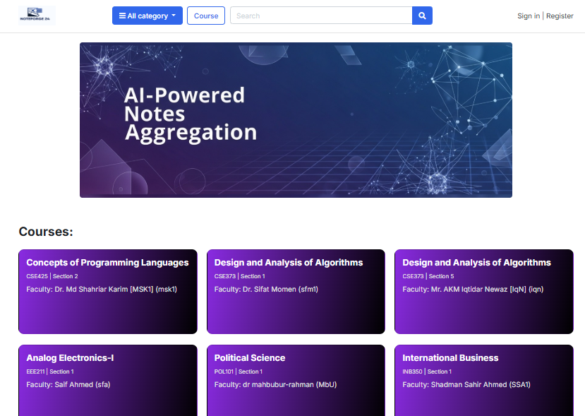
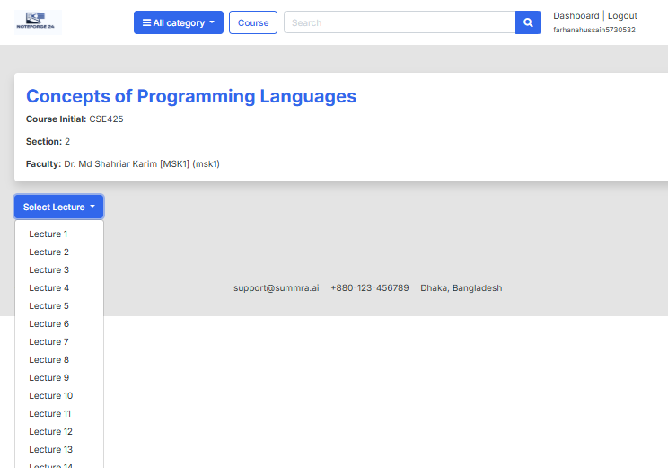
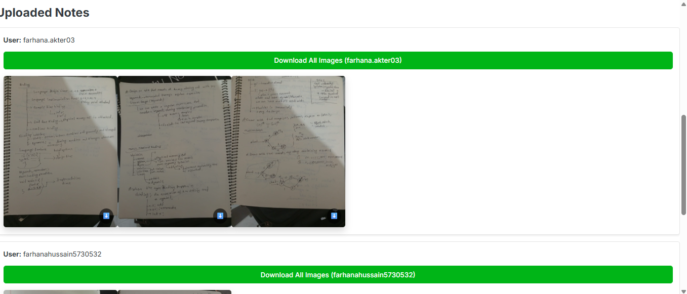

# Smart Collaborative Notes System

A Django-based collaborative note-sharing platform where multiple students upload handwritten lecture notes as images.  
The system enhances images using **OpenCV (CamScanner-like)**, extracts text using **AI OCR**, and automatically generates **lecture-wise PDFs 24 hours after class time**, even when courses have different schedules.

---

##  Features

-  Multi-user collaboration
-  Upload handwritten notes as images
-  **Image enhancement using OpenCV**
  - Auto contrast
  - Noise reduction
  - Sharpening
  - Perspective correction (CamScanner-style)
-  **Image download support**
  - Users can download their own uploaded images
  - Other students of the same course can also download images
-  AI-powered OCR (Gemini / LLM)
-  AI-based text cleaning & structuring
-  Course → Section → Lecture based organization
-  **Automatic PDF generation after class (24 hours)**
-  Lecture-wise combined PDF download
-  Background task processing with Celery
-  Duplicate PDF generation protection
-  Supports multiple courses with different class schedules

---
##  Screenshots

###  Home Page


###  Select Lecture


### 📚 Lecture View + Upload image


###  Downloadable images


##  How the System Works

1. Student uploads handwritten note images
2. Image is enhanced using OpenCV (CamScanner-like)
3. Enhanced image is stored and made downloadable
4. OCR extracts text from enhanced image
5. AI cleans and structures the extracted text
6. System waits until **24 hours after lecture end time**
7. Celery automatically generates final lecture PDF
8. All students can download the PDF

---

##  Tech Stack

| Layer | Technology |
|-----|-----------|
| Backend | Django |
| Task Queue | Celery |
| Scheduler | Celery Beat |
| Message Broker | Redis |
| AI / OCR | Gemini API |
| Image Processing | OpenCV |
| PDF Generation | ReportLab |
| Database | PostgreSQL / SQLite |
| Frontend | Django Templates |

---

##  Requirements & Dependencies

This project uses **Python 3.10+** and relies on Django, Celery, AI services, and OpenCV for image processing.

All dependencies are listed in the `requirements.txt` file.

### Key Libraries Used

- **Django 5.2** – Backend framework
- **Celery 5.6** – Background task processing
- **Redis** – Message broker
- **OpenCV** – Image enhancement (CamScanner-like)
   For better Image Resolution u can follow
- **https://github.com/xinntao/ESRGAN?tab=readme-ov-file**(gpu)
- **Google Gemini API** – OCR & AI text structuring
- **ReportLab** – PDF generation
- **Cloudinary** – Image storage

---

##  Background Services Required
  **Redis**--redis-server
  **Celery Worker & Celery Beat**--
  ```
  celery -A backend worker -l info
  celery -A backend beat -l info

  
  


  python -m venv env
  env\Scripts\activate
  pip install -r requirements.txt


